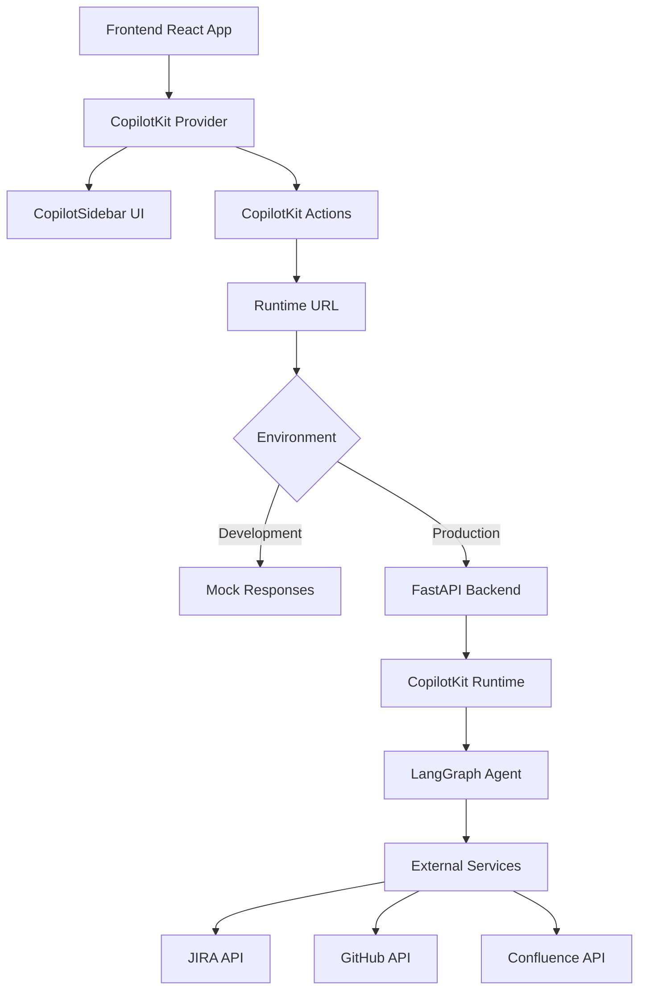

# CopilotKit Integration in Project Enigma
## Complete Workflow Explanation

### 📋 Table of Contents
1. [Overview](#overview)
2. [Architecture](#architecture)
3. [Setup & Configuration](#setup--configuration)
4. [Frontend Integration](#frontend-integration)
5. [API Flow & Communication](#api-flow--communication)
6. [AI Actions & Capabilities](#ai-actions--capabilities)
7. [Development vs Production Modes](#development-vs-production-modes)
8. [Workflow Examples](#workflow-examples)
9. [Troubleshooting](#troubleshooting)
10. [Best Practices](#best-practices)

---

## Overview

Project Enigma integrates **CopilotKit** to provide AI-powered conversational interfaces for release automation workflows. This integration enables users to interact with the release management system through natural language, making complex deployment processes more accessible and intuitive.

### 🎯 Key Features
- **Natural Language Interface**: Chat with AI to manage releases
- **Intelligent Actions**: AI can execute workflow actions based on conversation
- **Real-time Configuration**: Dynamic form updates through AI interactions
- **Repository Management**: AI-assisted repository selection and configuration
- **Release Automation**: AI-guided release and hotfix workflows

---

## Architecture

### 🏗️ High-Level Architecture



### 🔧 Technology Stack
- **Frontend**: React 18 + TypeScript + Vite
- **AI Framework**: CopilotKit React SDK
- **UI Library**: Custom components with Tailwind CSS
- **Backend Integration**: FastAPI (Python)
- **Development Server**: Vite with proxy configuration

---

## Setup & Configuration

### 📦 Dependencies

```json
{
  "@copilotkit/react-core": "^1.0.0",
  "@copilotkit/react-ui": "^1.0.0", 
  "@copilotkit/runtime": "^1.0.0"
}
```

### 🌐 Environment Variables

```bash
# Backend API Configuration
VITE_API_URL=http://localhost:8000

# CopilotKit Runtime Configuration
# Development (optional - uses mock mode if not set)
# VITE_COPILOT_RUNTIME_URL=http://localhost:8000/copilotkit

# Production
VITE_COPILOT_RUNTIME_URL=https://your-backend.com/copilotkit

# Application Configuration
VITE_NODE_ENV=development
VITE_DEBUG=false
```

### ⚙️ Vite Proxy Configuration

```typescript
// vite.config.ts
export default defineConfig({
  server: {
    proxy: {
      // Standard API requests
      '/api': {
        target: 'http://localhost:8000',
        changeOrigin: true,
        secure: false,
      },
      // CopilotKit runtime requests
      '/api/copilotkit': {
        target: 'http://localhost:8000',
        changeOrigin: true,
        secure: false,
        rewrite: (path) => path.replace('/api/copilotkit', '/copilotkit')
      }
    }
  }
})
```

---

## Frontend Integration

### 🚀 Provider Setup

```typescript
// src/main.tsx
const CopilotKitProvider: React.FC<{ children: React.ReactNode }> = ({ children }) => {
  const runtimeUrl = (import.meta as any).env?.VITE_COPILOT_RUNTIME_URL || '/api/copilotkit'
  
  return (
    <CopilotKit
      runtimeUrl={runtimeUrl}
      agent="release-automation-agent"
      showDevConsole={true}
    >
      {children}
    </CopilotKit>
  )
}
```

### 🎨 UI Components

```typescript
// Chat Interface Integration
import { CopilotSidebar } from '@copilotkit/react-ui'

const ChatPage = () => {
  return (
    <div className="flex h-screen">
      {/* Main Content */}
      <div className="flex-1">
        {/* Release Configuration Form */}
      </div>
      
      {/* AI Chat Sidebar */}
      <CopilotSidebar
        title="💬 Release Assistant"
        instructions="I help you manage release workflows..."
        labels={{
          title: "💬 Release Assistant",
          initial: "👋 Ready to help with your release workflow!"
        }}
        defaultOpen={false}
        clickOutsideToClose={false}
        className="border-l border-gray-200 bg-white shadow-xl"
      />
    </div>
  )
}
```

---

## API Flow & Communication

### 🔄 Request Flow

1. **User Input** → Chat interface
2. **CopilotKit** → Processes natural language
3. **Action Recognition** → Identifies relevant actions
4. **Runtime URL** → Routes to backend (`/api/copilotkit` → `/copilotkit`)
5. **Backend Processing** → FastAPI + LangGraph
6. **External APIs** → JIRA, GitHub, Confluence
7. **Response** → Back through the chain to UI

### 📡 Runtime URL Routing

```typescript
// Frontend Request
runtimeUrl: '/api/copilotkit'

// Vite Proxy Rewrite
'/api/copilotkit' → 'http://localhost:8000/copilotkit'

// Backend Endpoint
FastAPI: '/copilotkit' → CopilotKit Runtime
```

### 🔗 Network Architecture

```
Frontend (Port 3001) → Vite Proxy → Backend (Port 8000)
     ↓                     ↓              ↓
CopilotKit UI    →    Vite Dev Server  →  FastAPI
     ↓                     ↓              ↓
Chat Messages    →    Proxy Rules     →  /copilotkit endpoint
     ↓                     ↓              ↓
AI Actions       →    Path Rewriting   →  LangGraph Agent
```

---

## AI Actions & Capabilities

### 🤖 Defined Actions

#### 1. Start Release Workflow
```typescript
useCopilotAction({
  name: "start_release_workflow",
  description: "Start an automated release workflow with specified parameters",
  parameters: [
    {
      name: "repositories",
      type: "string[]",
      description: "List of repository IDs to include in the release",
      required: true,
    },
    {
      name: "releaseType", 
      type: "string",
      description: "Type of release: 'release' or 'hotfix'",
      required: true,
    },
    {
      name: "sprintName",
      type: "string", 
      description: "Name of the sprint for this release",
      required: true,
    },
    {
      name: "fixVersion",
      type: "string",
      description: "JIRA fix version for this release",
      required: true,
    },
  ],
  handler: async (args) => {
    // Workflow execution logic
    return `Starting ${args.releaseType} workflow...`
  }
})
```

#### 2. Repository Management
```typescript
useCopilotAction({
  name: "manage_repositories",
  description: "Get list of available repositories for release management",
  handler: async () => {
    const repoList = repositories.map(repo => `${repo.name} (${repo.id})`).join(', ')
    return `Available repositories: ${repoList}`
  }
})
```

#### 3. Configuration Management
```typescript
useCopilotAction({
  name: "get_release_config",
  description: "Get the current release configuration from the form",
  handler: async () => {
    return `Current configuration:
- Selected Repositories: ${selectedRepositories.join(', ')}
- Release Type: ${releaseType}
- Sprint Name: ${sprintName}
- Fix Version: ${fixVersion}
- Ready to start: ${isConfigValid ? 'Yes' : 'No'}`
  }
})
```

### 💬 Natural Language Examples

Users can interact with these actions through natural language:

- **"Start a release for the backend and frontend repos"**
- **"What's my current configuration?"**
- **"Show me available repositories"**
- **"I want to create a hotfix for sprint-2024-01"**
- **"Set the fix version to 1.2.3"**

---

## Development vs Production Modes

### 🔧 Development Mode (Mock Responses)

When `VITE_COPILOT_RUNTIME_URL` is not set:

```typescript
// Fallback to mock mode
const runtimeUrl = env?.VITE_COPILOT_RUNTIME_URL || '/api/copilotkit'

// Mock responses in utils/copilotkit-dev.ts
export const mockCopilotResponses = {
  start_release_workflow: (params) => {
    return `🚀 Mock: Starting ${params.releaseType} workflow...`
  },
  manage_repositories: () => {
    return `📁 Mock: Available repositories - backend, frontend, api...`
  }
}
```

**Benefits:**
- ✅ Frontend development without backend dependency
- ✅ Action testing and UI validation
- ✅ Rapid prototyping and iteration
- ✅ No external service requirements

### 🚀 Production Mode (Real Backend)

With backend integration:

```typescript
// Real CopilotKit runtime
VITE_COPILOT_RUNTIME_URL=https://api.projectenigma.com/copilotkit
```

**Backend Components:**
- FastAPI server with CopilotKit runtime
- LangGraph agent for AI processing
- Real integrations with JIRA, GitHub, Confluence
- Persistent workflow state management

---

## Workflow Examples

### 📋 Example 1: Release Creation

**User:** *"I want to start a new release for our sprint"*

**AI Flow:**
1. AI recognizes intent → Release workflow
2. Checks current configuration
3. Asks for missing parameters
4. Executes `start_release_workflow` action
5. Provides status updates

**Backend Processing:**
1. Validates repositories and permissions
2. Creates JIRA tickets
3. Generates release branches
4. Updates Confluence documentation
5. Returns workflow status

### 📋 Example 2: Configuration Check

**User:** *"What's my current setup?"*

**AI Response:**
```
Current configuration:
- Selected Repositories: backend-api, frontend-app
- Release Type: release
- Sprint Name: sprint-2024-01
- Fix Version: 1.2.0
- Ready to start: Yes

You're all set! Would you like me to start the release workflow?
```

### 📋 Example 3: Repository Management

**User:** *"Show me all available repositories"*

**AI Response:**
```
Available repositories:
- backend-api (id: repo-001)
- frontend-app (id: repo-002) 
- mobile-app (id: repo-003)
- documentation (id: repo-004)

Which repositories would you like to include in your release?
```

---

## Troubleshooting

### 🐛 Common Issues

#### 1. Chat Button Not Responding
```css
/* Custom CSS targeting for CopilotKit button */
div[style*="position: fixed"][style*="bottom"][style*="right"] button {
  background: linear-gradient(135deg, #667eea 0%, #764ba2 100%) !important;
  /* Custom styling */
}
```

#### 2. Runtime URL Connection Issues
```typescript
// Check environment variable
console.log('Runtime URL:', runtimeUrl)

// Verify proxy configuration
// Network tab should show requests to /api/copilotkit
```

#### 3. Actions Not Triggering
```typescript
// Ensure actions are properly registered
useCopilotAction({
  name: "action_name", // Must be unique
  description: "Clear description", // Helps AI understand
  handler: async (args) => {
    console.log('Action triggered:', args)
    return "Response message"
  }
})
```

#### 4. CORS Issues
```typescript
// vite.config.ts
proxy: {
  '/api/copilotkit': {
    target: 'http://localhost:8000',
    changeOrigin: true, // Important for CORS
    secure: false,
  }
}
```

### 🔍 Debugging Tips

1. **Enable Dev Console**: `showDevConsole={true}`
2. **Check Network Tab**: Monitor `/api/copilotkit` requests
3. **Console Logging**: Add logs in action handlers
4. **Environment Variables**: Verify with `import.meta.env`

---

## Best Practices

### ✅ Do's

1. **Clear Action Descriptions**: Help AI understand capabilities
2. **Type Safety**: Use TypeScript for parameter validation
3. **Error Handling**: Implement robust error responses
4. **User Feedback**: Provide clear status messages
5. **Environment Separation**: Different configs for dev/prod

### ❌ Don'ts

1. **Sensitive Data**: Never expose secrets in frontend
2. **Blocking Operations**: Keep actions responsive
3. **Poor Error Messages**: Always provide helpful feedback
4. **Missing Validation**: Validate all action parameters
5. **Complex Logic**: Keep action handlers focused

### 🎯 Optimization Tips

1. **Lazy Loading**: Load CopilotKit components on demand
2. **Caching**: Cache repository lists and configuration
3. **Debouncing**: Prevent rapid-fire action triggers
4. **Progressive Enhancement**: Graceful fallbacks for mock mode

---

## Conclusion

The CopilotKit integration in Project Enigma provides a powerful, conversational interface for complex release workflows. By combining AI-powered natural language processing with structured actions and real-time updates, users can efficiently manage releases through intuitive chat interactions.

### 🚀 Next Steps

1. **Backend Integration**: Implement FastAPI CopilotKit runtime
2. **Advanced Actions**: Add more sophisticated workflow capabilities
3. **Context Awareness**: Enhance AI understanding of project state
4. **Multi-tenant Support**: Scale for multiple teams and projects

### 📚 Additional Resources

- [CopilotKit Documentation](https://docs.copilotkit.ai)
- [FastAPI Integration Guide](https://docs.copilotkit.ai/integrations/fastapi)
- [LangGraph Documentation](https://langchain-ai.github.io/langgraph/)
- [Project Enigma Repository](https://github.com/ProjectEnigmaHackathon/ProjectEngimaFE)

---

*This documentation covers the complete CopilotKit integration workflow in Project Enigma. For technical support or feature requests, please refer to the project repository or contact the development team.* 